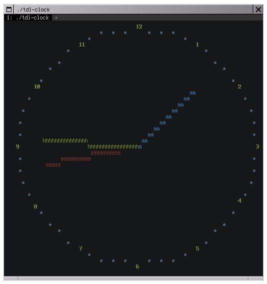

# tdl-clock

An ASCII analog clock written in C.

This program does not use curses for console graphics. It uses [TDL](https://github.com/celtrecium/tdl), a curses-like library written by my friend [Celtrecium](https://github.com/celtrecium).

  

## Building

Your terminal must support basic ANSI escape codes (16 colors, bold font, hiding cursor and alternate screen for convenience) to use this program.

With CMake >= 3.11.4 (supported compilers are GCC and Clang):
1. `mkdir build && cd build`
2. `cmake ..`
3. `cmake --build .` or name of used generator

Then just type path to the `tdl-clock` binary (it should be in the same directory) in your terminal.

If you want also install it, then in the build directory type `cmake --install .` (you may need root privileges to do this).
If your CMake installation is older than the 3.15 version, type `cmake --build . --target install`.

## Third-party libraries

These third-party libraries are used by this program. The CMake file automatically downloads and builds them.

* [TDL](https://github.com/celtrecium/tdl)
* [libu8string](https://github.com/celtrecium/libu8string)
* [libsbvector](https://github.com/celtrecium/libsbvector)
